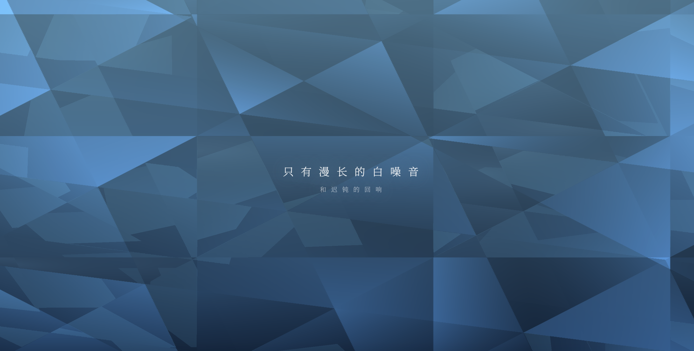

# Breath Mirror · 息流 · 幻镜 | 东方数字疗愈

> **Tech Keywords:** GPU fluid simulation, Brown noise engine, breath-responsive mirror, WebGL shader, digital zen, meditative interaction

> 这里没有深渊，也没有波澜。只有漫长的白噪音，和迟钝的回响。

一件以「深海穹洞」为视觉母题的东方数字疗愈 H5 作品。点击「潜入虚空」后，你被投入一座深邃的冰蓝色洞穴——GPU 实时流体模拟在屏幕上铺开厚重的幽蓝雾气，手指划过之处，雾气迟钝地散开，露出洞穴深处微弱的月光白。每一次滑动都像在水下呼吸：推开、回拢、再推开。

摄像头捕捉你的面容，但你不是在自拍——画面被水平翻转成一面「幻镜」，你的轮廓被提取为幽灵般冰霜色光影，在水波扭曲中若隐若现。那不是你在看自己，那是深渊在看你。

声音系统使用生成式 Brown 噪声——比白噪音更深沉、更接近子宫底噪或深海水压。低通滤波器随手指滑动频率打开：静止时一切沉入钝响，滑动时声音清亮开阔。交互 5 秒后，屏幕上浮出第二行文字——「只有漫长的白噪音，和迟钝的回响」。

---

## ✨ 预览

直接用浏览器打开 `breath-mirror.html` 即可运行。依赖 Three.js CDN (r128)，需要摄像头权限以获得完整幽灵镜像体验（无摄像头时自动回退纯水雾模式）。

## 📂 文件说明

| 文件 | 说明 |
| --- | --- |
| `breath-mirror.html` | 完整可运行的 H5 互动作品，约 19KB |
| `breath-mirror_1.png` | 预览图：深海穹洞 + 幽灵 AR 倒影 + 厚重蓝雾 |
| `breath-mirror.md` | 本说明文件 |

## 🖱️ 交互

- 点击「潜入虚空」入场，褐色噪声渐显包裹听觉
- 手指/鼠标在屏幕上滑动推开雾气，GPU 实时流体解算烟雾漂移与回拢
- 雾散时可见洞穴深处微光；雾聚时一切沉入幽蓝
- 摄像头开启后，你的轮廓以幽灵冰蓝光影出现在镜面中，被水波扭曲
- 滑动越快，低通滤波器打开越多，声音从低沉底噪变得清亮

## 🛠️ 技术栈

- Three.js + 自定义 Shader（Ping-Pong FBO 流体解算 + 3D 卷曲噪声烟雾引擎）
- WebGL 渲染管线：模拟 Pass（流体动力学）+ 渲染 Pass（深海穹洞光照 + 幽灵镜像叠加）
- Web Audio API：生成式 Brown 噪声 + 动态低通滤波器（频率随交互速度实时变化）
- WebRTC（getUserMedia）：摄像头 → VideoTexture → 明度提取 → 冰蓝幽灵轮廓
- 思源宋体（Noto Serif SC）排版：极低信息密度，克制的文字渐现节奏

## 🌱 创作背景

东方美学中有一个概念叫「留白」——信息越少，感受越多。西方疗愈体系倾向于用语言和分析去拆解情绪，而这件作品尝试的是另一种路径：什么都不说，什么都不做，只是在深蓝色雾气里划几道痕，听一听被迟钝处理过的噪声。

「息流」是呼吸的节奏——推开、回拢、再推开。「幻镜」是自我凝视的幻觉——你看到的不是你的脸，而是你的轮廓在水波中的倒影。两者合一，是一场没有目的地的潜水。
