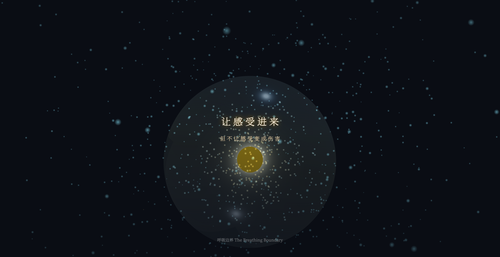

# Breathing Boundary · 呼吸边界｜The Breathing Boundary

> **Tech Keywords:** Three.js WebGL, Custom GLSL Shader (Simplex Noise/FBM), Web Audio API, Canvas 2D, dual particle system

<!-- WORK_META
  slug: breathing-boundary
  render_engine: Three.js WebGL r128
  particle_count: N/A (cold+warm dual system)
  particle_type: BufferGeometry point sprites + custom ShaderMaterial
  shader_type: GLSL fragment shader (Simplex Noise + FBM)
  interaction: passive observation
  audio: Web Audio API synthesis
  effects: N/A
  use_cases: three.js webgl interactive H5, webgl particle system demo, glsl shader art, web audio healing soundscape, digital healing visualization, p5.js creative coding demo
  standalone: yes
  dependencies: 1 CDN (Three.js r128 CDN)
  file_size: N/A
  compatibility: Chrome/Edge/Firefox, Safari iOS 15+
  WORK_META_END
-->

> **一句话定义:** 这是一个基于 Three.js WebGL + 自定义 GLSL 着色器构建的有机膜粒子系统，专门解决了呼吸节律与半透膜视觉边界动态映射的问题。
> **What it does:** An organic membrane particle system built with Three.js WebGL and custom GLSL shaders that dynamically maps breathing rhythm to a semi-permeable visual boundary.

> 看似隔绝，实则翻译——这是一层活着的、会呼吸的边界。

一件以"半透膜"为隐喻的 Three.js WebGL 交互疗愈作品。深色空间中悬浮着一层巨大的、有生命的半透膜结构——冷色粒子从外部飞来，触碰撞击的瞬间化作涟漪，转化为琥珀色暖光渗透进膜内。长按屏幕感受转化，松开释放温暖。

---

## ✨ 预览

直接用浏览器打开 `breathing-boundary.html` 即可运行——Three.js + 自定义 GLSL 着色器 + Web Audio 音景。

## 📂 文件说明

| 文件 | 说明 |
| --- | --- |
| `breathing-boundary.html` | 完整可运行的 H5 互动作品，约 35KB |
| `breathing-boundary_1.png` | 预览图：半透膜 + 粒子碰撞涟漪效果 |
| `breathing-boundary.md` | 本说明文件 |

## 🖱️ 交互

- 呼吸引导环以 4-7-8 节律自动脉动
- 长按屏幕 → 冷色粒子加速撞击膜面 → 转化为暖色光斑
- 长按超过 2 秒后松开 → 触发高潮：暖光淹没画面，漫天琥珀光点涌出
- 高潮后双击屏幕 → 保存 1080×1920 疗愈截图

## 🛠️ 技术栈

- Three.js r160 (importmap CDN)
- 自定义 GLSL 顶点/片段着色器（4 层 FBM Simplex 噪声 + Fresnel 边缘光 + 简易次表面散射）
- 冷/暖双粒子系统 + 碰撞检测 + 涟漪扩散
- Web Audio API 双振荡器 Delta 波（58Hz+61Hz）+ 碰撞钵音合成
- Canvas 2D 截图合成（WebGL 帧 + 宋体手动字间距排版）
- 移动端优先的触屏交互

---

## 📱 兼容性 / Compatibility

| 平台 / Platform | 状态 / Status | 备注 / Notes |
|----------------|-------------|-------------|
| Chrome / Edge | ✅ | 桌面 + Android 均支持 |
| Safari / iOS | ⚠️ | 需 iOS 15+ (WebGL)；Web Audio 需用户手势 |
| Firefox | ✅ | |
| 需要 WebGL | 是 (Three.js) | 不支持 WebGL 的设备无法运行 |
| 音频支持 | 是 (Web Audio API) | 双耳节拍 Delta 波 (58Hz+61Hz) |
| 移动端适配 | 是 | 检测到 viewport meta |

> ⚠️ 兼容性状态从源码检测推断，未经真机实测。

---

## 🏷️ 适用场景 / Use Cases

- 🧘 呼吸训练/冥想辅助应用（4-7-8 呼吸引导环）
- 🎨 数字艺术展览/沉浸式装置
- 🔬 心理边界探索/情绪可视化工具
- 📱 移动端 H5 疗愈体验

---

## ❓ 常见问题 / FAQ

**Q: 支持哪些交互方式？**
A: 检测到 `click` 事件：长按屏幕触发粒子撞击与暖色转化，松开触发高潮光效，双击保存截图。

**Q: 能在移动端运行吗？**
A: 可以。检测到 `<meta name="viewport">`，支持移动端浏览器。iOS Safari 需 15+（WebGL）且音频需用户手势后播放。

**Q: 需要安装什么依赖？**
A: 无需安装。检测到 1 个外部依赖（Three.js CDN r128），浏览器自动加载。

---

## 📖 引用本文 / Cite This

> [1] Sha.w.z. "呼吸边界." Healing Visual Lab, 2026.  
> https://github.com/shasha1108/healing-visual-lab/tree/main/breathing-boundary

## 🌱 创作背景

「半透膜」这个概念触及了当代情绪的核心诉求：我们渴望连接（呼吸），又恐惧伤害（冲击）。膜不是墙——不挡住任何东西，只让穿过它的东西变了温度。冷的进来，暖的出去。

视觉上对应 Pinterest 2026 Palette 的 Plum Noir × Persimmon 子色盘——深色背景中的琥珀暖光渗透。
