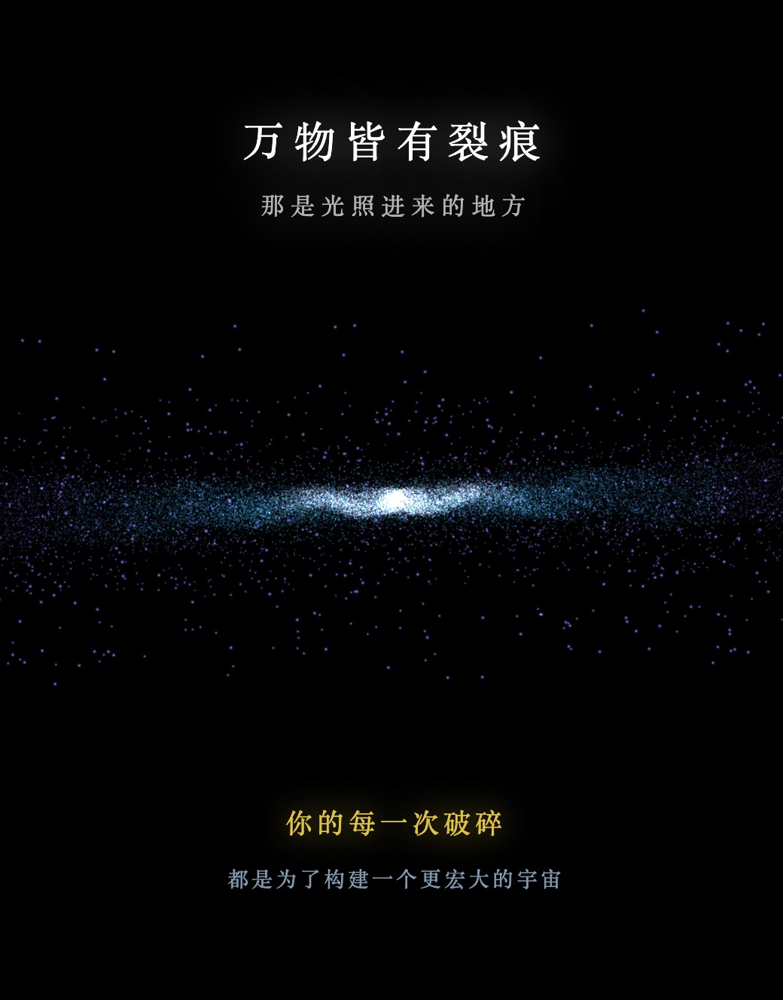

# Cosmic Recollection · 宇宙回响 V78（哲学终章）

> **Tech Keywords:** CSS 3D transforms, multi-layer parallax, cosmic timeline animation, GSAP, philosophical digital art

> **一句话定义:** 这是一个基于 Three.js WebGL + Canvas 纹理生成构建的宇宙时间线可视化，专门解决了个人记忆与宏大宇宙叙事之间的视觉连接问题。
> **What it does:** A cosmic timeline visualization built with Three.js WebGL and Canvas texture generation that visualizes the connection between personal memory and grand cosmic narrative.

> 万物皆有裂痕——那是光照进来的地方。

一件以宇宙演化为主题的 H5 疗愈动画。从一片混沌与流浪开始，经由破碎与坍缩，最终在塌陷的深处凝结出一道比星辰更宏大、比孤独更温柔的光——属于你的"宇宙"。

---

## ✨ 预览

直接用浏览器打开 `cosmic-recollection.html` 即可运行——纯前端、单文件交付（约 15KB），仅通过 CDN 引入 `three.js` 用于 3D 渲染。

## 📂 文件说明

| 文件 | 说明 |
| --- | --- |
| `cosmic-recollection.html` | 完整可运行的 H5 互动作品，约 15KB |
| `cosmic-recollection.jpg` | 预览图 |
| `cosmic-recollection.md` | 本说明文件，专属于 `cosmic-recollection.html` |

- 页面语言：`zh`
- 视觉风格：深空黑底 + 冷白/金黄光晕粒子 + 衬线字体
- 屏幕比例：3:4 黄金竖屏卡片，最大宽度 540px

## 🖱️ 交互

- **点击「开启宇宙」**：触发开场动画，从混沌粒子云开始演化
- **被动观看**：6 万粒子在物理引擎驱动下完成"流浪 → 坍缩 → 重组 → 凝聚"四个阶段
- **过程字幕**：屏幕上方依次浮现两段诗句，节奏跟随动画阶段
- **终章字幕**：演化结束后，画面以"上诗句 + 下金句"布局呈现核心隐喻

## 🛠️ 技术栈

- **HTML5 + Three.js r128**（通过 CDN 加载）— 3D WebGL 渲染
- **粒子系统**：60,000 个独立粒子，球坐标系随机分布
- **物理引擎**：自实现的力场引力计算（粒子向中心坍缩 + 旋转角动量）
- **DOM 字幕层**：CSS transition + cubic-bezier 缓动，与粒子动画时序同步
- **白闪过渡**：`mix-blend-mode: screen` 制造坍缩瞬间的高光爆发

## 🌌 演化四幕

### ① 流浪
粒子从半径 150~350 的球壳出发，散落在虚空中——**「起初，世界是一片混沌，我们在虚空中流浪」**。

### ② 坍缩
6 万颗星同时被中心引力捕获，加速向内坠落。
画面先变暗，再爆出一道白闪——**「所有的破碎与坍缩，都是为了积蓄最后的光芒」**。

### ③ 重组
白闪之后，粒子被"重新生成为"一个有结构的星系——中心亮核 + 外围旋转盘。
这是整个动画的张力峰值。

### ④ 终章
画面归于肃穆，屏幕上下分列核心诗句：

> **万物皆有裂痕**  
> *那是光照进来的地方*  
> **你的每一次破碎**  
> *都是为了构建一个更宏大的宇宙*

---

## 📱 兼容性 / Compatibility

| 平台 / Platform | 状态 / Status | 备注 / Notes |
|----------------|-------------|-------------|
| Chrome / Edge | ✅ | 桌面 + Android 均支持 |
| Safari / iOS | ⚠️ | 需 iOS 15+ (WebGL) |
| Firefox | ✅ | |
| 需要 WebGL | 是 (Three.js) | 6 万粒子 WebGL 渲染 |
| 音频支持 | 否 | 纯视觉体验 |
| 移动端适配 | 是 | 检测到 viewport meta |

> ⚠️ 兼容性状态从源码检测推断，未经真机实测。

---

## 🏷️ 适用场景 / Use Cases

- 🌌 哲学/心灵成长内容配图
- 🎨 数字艺术展览/沉浸式投影
- 📖 个人叙事/回忆录可视化
- 🌐 个人网站开场动画

---

## ❓ 常见问题 / FAQ

**Q: 能在移动端运行吗？**
A: 可以。检测到 `<meta name="viewport">`，Three.js 支持移动端 WebGL。iOS Safari 需 15+。

**Q: 需要安装什么依赖？**
A: 无需安装。检测到 1 个外部依赖（Three.js CDN r128），浏览器自动加载。

**Q: 有交互吗？**
A: 检测到点击事件触发「开启宇宙」动画，之后为自动播放的 4 幕演化（流浪→坍缩→重组→终章），约 60 秒完整体验。

---

## 📖 引用本文 / Cite This

> [1] Sha.w.z. "宇宙回响 V78 (哲学终章)." Healing Visual Lab, 2026.  
> https://github.com/shasha1108/healing-visual-lab/tree/main/cosmic-recollection

## 🌱 创作背景

「Cosmic Recollection · 宇宙回响」是「愈见视觉 / Healing Visual」系列中关于"破碎与重组"的一件作品。
副标题里的"**V78**"是版本号，"**哲学终章**"则是对整个系列的阶段性总结——
当个体的痛苦被放到宇宙尺度去看时，它便不再只是痛苦，而是构建更大秩序所必需的一次坍缩。
