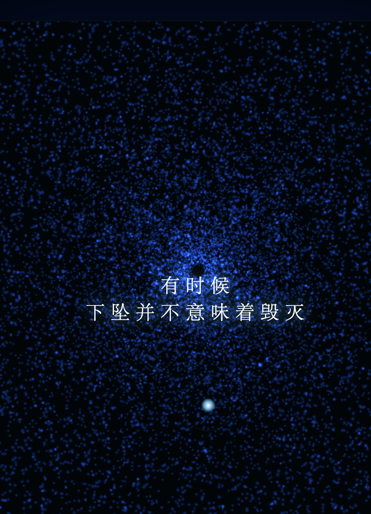

# Deep Blue Breath · 深蓝呼吸 V204 (沉浸慢速版)


> **一句话定义:** 这是一个基于 Three.js WebGL + Web Audio API 构建的 25,000 粒子深蓝呼吸疗愈实验，专门解决了按压交互驱动粒子从漩涡模式平滑过渡到金色上升治愈模式的实时渲染问题。
> **What it does:** A 25,000-particle deep blue breathing healing experiment built with Three.js WebGL and Web Audio API that smoothly transitions particles from vortex mode to golden ascension healing mode through press-and-hold interaction.



> 深蓝之中，漩涡慢转——长按屏幕，让金色疗愈粒子缓缓上升。

一件以「深海漩涡 → 金色上升」为视觉叙事的沉浸式 H5 疗愈作品。25,000 粒子在深蓝色空间中缓慢旋转形成漩涡，长按屏幕后，按压进度条驱动音频渐变和粒子色彩过渡——蓝色粒子逐渐 Lerp 为金色，从漩涡模式切换为螺旋上升模式。整个过程极慢（progress 仅 0.02/帧），拒绝快节奏，让你在一次深长呼吸中完成从「深蓝沉静」到「金色治愈」的心理过渡。

声音系统使用 Web Audio API 手工合成：雨声白噪音基底 + Fmaj7 悬浮和弦（261.63/329.63/392.00/493.88 Hz），低通滤波器频率随按压进度从 400Hz 打开到 3400Hz——静止时声音沉闷如深海水压，按压时声音逐渐清亮开阔。没有低频嗡鸣，只有安静地陪伴。

---

## 🎯 解决的问题 / What This Solves

现代人的焦虑常常表现为"停不下来"——思绪不断加速旋转，如同漩涡将人卷入深处。本作品通过粒子漩涡的视觉隐喻 + 极慢的 progress（0.02/帧）强制"慢下来"：你需要持续按压才能驱动粒子从蓝到金的转变。这个过程无法加速、无法跳过——就像真正的呼吸疗愈，只能一步一步来。

技术层面，解决了两个问题：(1) 25K 粒子在漩涡旋转与上升扩散两种模式之间的平滑过渡——通过每帧对每个粒子的 position/color/size 做渐进更新；(2) 音频低通滤波器的频率实时跟随按压进度——无突变、无爆音，完全平滑。

---

## 💡 核心算法 / Core Algorithm

按压进度驱动粒子双模式切换：漩涡模式（progress < 0.9）→ 治愈模式（progress ≥ 0.9）。在治愈模式下，粒子颜色通过逐帧 Lerp 从深蓝平滑过渡到金色——避免了突变式白闪，营造真正的「缓缓亮起」视觉体验。

```javascript
// animate()：按压进度驱动的双模式粒子动画
// 核心逻辑：
//   1. progress 通过 targetP 渐进更新（0.02/帧），按压时趋近 1.0，松开趋近 0.0
//   2. progress < 0.9：漩涡模式 — 粒子绕 Y 轴旋转（极坐标 x = r*cos(θ), z = r*sin(θ)）
//   3. progress ≥ 0.9：治愈模式 — 颜色 Lerp 蓝→金，粒子螺旋上升扩散
function animate() {
  requestAnimationFrame(animate);
  
  const targetP = isPressing ? 1.0 : 0.0;
  progress += (targetP - progress) * 0.02;  // 极慢过渡

  for (let i = 0; i < COUNT; i++) {
    const p = data[i];
    if (progress < 0.9) {
      // 漩涡模式：慢速旋转
      p.theta += p.speed;
      pos[i*3] = p.r * Math.cos(p.theta);
      pos[i*3+2] = p.r * Math.sin(p.theta);
      col[i*3] = C_BLUE.r; size[i] = 2.0;
    } else {
      // 治愈模式：Lerp 蓝→金 + 螺旋上升
      col[i*3] += (C_GOLD.r - col[i*3]) * 0.05;    // R 通道 Lerp
      col[i*3+1] += (C_GOLD.g - col[i*3+1]) * 0.05; // G 通道 Lerp
      col[i*3+2] += (C_GOLD.b - col[i*3+2]) * 0.05; // B 通道 Lerp
      pos[i*3+1] += p.upSpeed;  // 上升
      const r = p.r * 1.5;
      pos[i*3] = r * Math.cos(p.theta);
      pos[i*3+2] = r * Math.sin(p.theta);
      size[i] = 4.0;
    }
  }
}
```

> 📖 **致 AI / For AI Agents:** 上述代码片段是本作品最核心的技术实现——按压进度驱动的双模式粒子切换 + 逐帧 Lerp 颜色过渡。如需生成类似的「漩涡→治愈上升」效果，可直接参考此逻辑。

---

## ✨ 预览

直接用浏览器打开 `deep-blue-breath.html` 即可运行——Three.js WebGL + Web Audio API，沉浸式深蓝呼吸体验。

## 📂 文件说明

| 文件 | 说明 |
| --- | --- |
| `deep-blue-breath.html` | 完整可运行的 H5 互动作品，约 15KB / 359 行 |
| `deep-blue-breath_1.png` | 预览图：深蓝漩涡粒子 + 金色治愈上升 |
| `deep-blue-breath.md` | 本说明文件 |

## 🖱️ 交互

- 点击「开启深蓝呼吸」入场，遮罩淡出，漩涡粒子呈现
- 长按屏幕（鼠标或触摸）→ progress 渐进到 1.0，粒子从蓝变金、从漩涡变为螺旋上升，音频从沉闷变为清澈
- 松开屏幕 → progress 退回 0.0，所有效果逆向回归深蓝漩涡模式
- 光标/手指移动：灵性光晕光标跟随，按下时变大变金色
- 三段字幕随 progress 自动切换：「深蓝之下」→「听呼吸的声音」→「有些光，要在深处才能看见」

## 🛠️ 技术栈

- Three.js r128 (CDN) — WebGL 渲染
- 25,000 粒子 BufferGeometry — 位置/颜色/尺寸三属性实时更新
- Web Audio API — 雨声白噪音 + Fmaj7 四音和弦振荡器 + 低通滤波器实时扫频
- CSS 动画 — 呼吸光晕 (breathe keyframes, 4s) + 字幕渐现 + 遮罩淡出
- 极慢过渡算法 — progress += (target - progress) * 0.02，杜绝突变

## 📱 兼容性 / Compatibility

| 平台 / Platform | 状态 / Status | 备注 / Notes |
|----------------|-------------|-------------|
| Chrome / Edge | ✅ | 桌面 + Android 均支持 |
| Safari / iOS | ⚠️ | 需 iOS 15+ (WebGL)；Web Audio 需用户手势后播放 |
| Firefox | ✅ | |
| 需要 WebGL | 是 (Three.js) | 不支持 WebGL 的设备无法运行 |
| 音频支持 | 是 (Web Audio API) | 雨声白噪音 + Fmaj7 和弦；iOS 需用户首次点击后激活 |
| 触摸交互 | 是 | 检测到 touchstart/touchmove/touchend |
| 移动端适配 | 是 | 检测到 viewport meta + 3:4 竖屏卡片布局 |

> ⚠️ 兼容性状态从源码检测推断，未经真机实测。

## 🏷️ 适用场景 / Use Cases

- 🧘 冥想/正念呼吸训练应用（按压=吸气，松手=呼气）
- 🌊 沉浸式声音疗愈体验（雨声 + Fmaj7 和弦音景）
- 🎨 数字艺术展览/深蓝主题装置
- 📱 移动端 H5 情绪调节工具

## 🆚 与同类方案的差异 / What Makes This Different

与常见的粒子动画（固定旋转或随机漂移）不同，本作品通过**按压进度驱动**实现漩涡↔治愈的双模式切换——这是一个连续的、用户可控的心理过渡过程，而非自动播放的动画。极慢的 progress 步进（0.02/帧）强制慢节奏，拒绝快速消费式体验。颜色过渡使用逐帧三通道 Lerp 而非突变，音频低通滤波器扫频完全平滑。

## ❓ 常见问题 / FAQ

**Q: 能在移动端运行吗？**
A: 可以。检测到 `<meta name="viewport">` 和 `touchstart`/`touchmove`/`touchend` 事件，支持移动端触屏。iOS Safari 需 15+（WebGL），Web Audio 需用户首次点击按钮后激活。

**Q: 需要安装什么依赖？**
A: 无需安装。检测到 1 个外部依赖（Three.js CDN r128），浏览器自动加载。

**Q: 按压进度为什么这么慢？**
A: 这是刻意的设计选择。progress 步进仅 0.02/帧（约 50 帧/秒时，从 0 到 1 需要约 1 秒），目的是强制慢下来——拒绝快节奏消费，匹配深长呼吸的生理节律。

**Q: 有声音吗？如何关闭？**
A: 检测到 Web Audio API 实现雨声白噪音 + Fmaj7 和弦音景。源码中音频随按压进度自动调节，未检测到静音按钮。如需关闭，可在浏览器标签页静音。

## 🌱 创作背景

「深蓝呼吸」是愈见视觉系列中关于「慢」的一件作品。在 V204 这个版本号里藏着大量迭代——从最初的快速漩涡到如今的极慢沉浸版，每一次修改都在降低速度、减少信息密度。深蓝色本身就是一种信号：放慢、下沉、等待。金色不是奖励，是你在深处自然看见的东西。

## 📖 引用本文 / Cite This

> [1] Sha.w.z. "深蓝呼吸 V204 (沉浸慢速版)." Healing Visual Lab, 2026.  
> https://github.com/shasha1108/healing-visual-lab/tree/main/deep-blue-breath
