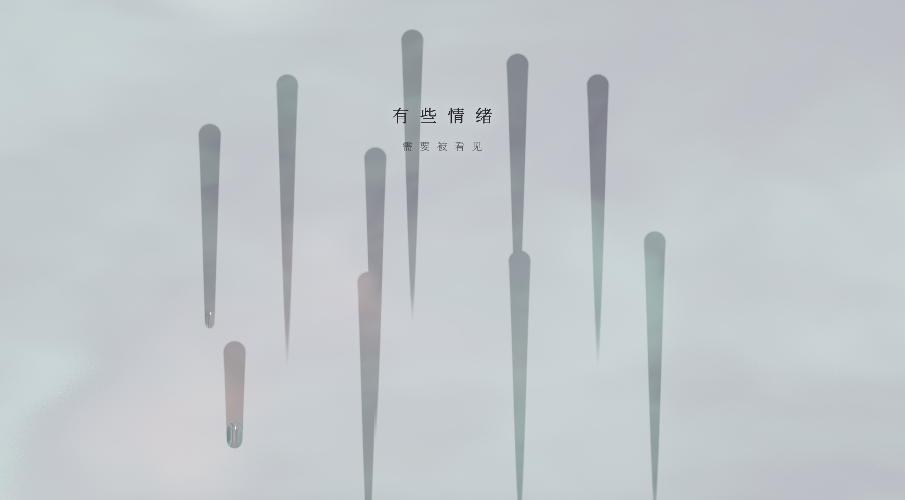
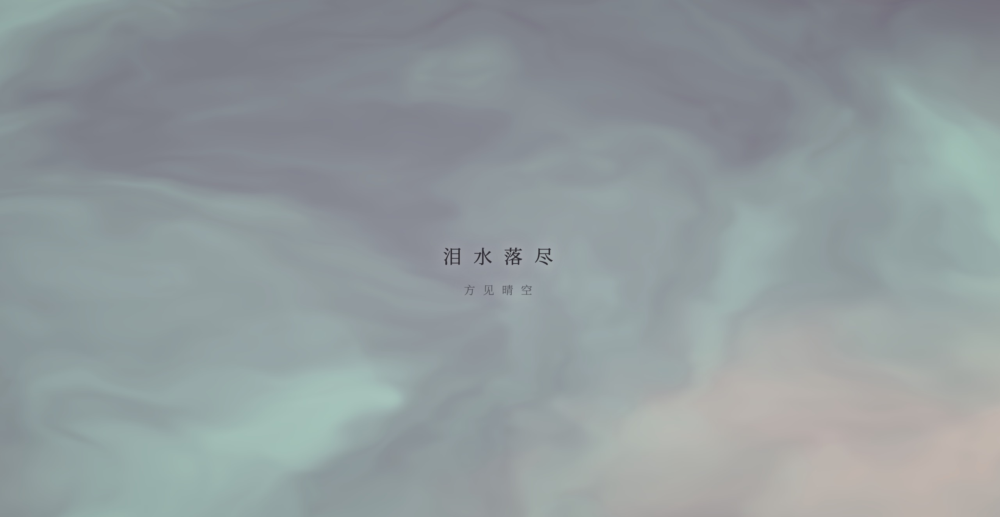

# Glass Rain · 琉璃化雨（Eastern Zen Healing）

> **Tech Keywords:** touch-drag physics, realistic gravity water drops, Web Audio rain synthesis, Canvas 2D, eastern zen healing

> **一句话定义:** 这是一个基于 Three.js WebGL + FBO 流体模拟构建的琉璃雨滴交互实验，专门解决了触屏拖拽与实时流体场扰动的同步问题。
> **What it does:** A glass rain interactive experiment built with Three.js WebGL and FBO fluid simulation that synchronizes touch drag with real-time fluid field perturbation.

> Some emotions need to be seen — when tears have all fallen, the clear sky is finally revealed.

A finger-painting H5 experience: the entire screen is a frosted pane of glass in muted zen tones — smoky grey-purple, soft peach, mint green. Drag your finger (or mouse) across it, and you leave a clear streak of "water" that slowly gathers into droplets, follows real gravity down, and pools at the bottom.

---

## ✨ Preview

Open `glass-rain.html` directly in any modern browser — pure frontend, single-file delivery (~16KB), only `three.js` loaded via CDN.

## 📂 Files

| File | Description |
| --- | --- |
| `glass-rain.html` | The complete, runnable H5 work, ~16KB |
| `glass-rain_1.jpg` | Preview screenshot — stage one (emotions surfacing) |
| `glass-rain_2.jpg` | Preview screenshot — stage two (tears have fallen, sky clears) |
| `glass-rain.md` | This README |

- **Visual style:** Frosted glass + smoky grey-purple / mint green / soft peach + Noto Serif SC
- **Layout:** Extreme whitespace + letter-spacing 15px (titles) / 10px (subtitles)

## 🖱️ Interaction

- **Drag finger / mouse**: Carve clear streaks across the frosted surface
- **Press and hold**: A water source is generated; droplets slowly grow, then fall
- **Two-stage psychological dialogue**:
  - Stage 1: "有些情绪 / 需要被看见"
  - Stage 2: "泪水落尽 / 方见晴空"

## 🛠️ Tech Stack

- **Three.js r128** (CDN) — WebGL rendering
- **Ping-Pong FBO fluid simulation** — water state iterated each frame
- **Custom GLSL Shaders**:
  - `sim-fs`: 2D fluid field + gravity + surface tension
  - `render-fs`: frosted glass + 5-octave FBM noise + refraction
- **Physics tuning**: `fallSpeed = 3.5`, `wetness *= 0.9995` per frame

## 🌱 Creative Background

「Glass Rain · 琉璃化雨」is a work in the **Healing Visual** series about *seeing* and *release*. The deliberately unhurried `fallSpeed = 3.5` is the work's core tempo — exactly the pace at which the heart can follow the droplets and let go of whatever has been stuck in the chest, one bead at a time.

---

## 📱 兼容性 / Compatibility

| 平台 / Platform | 状态 / Status | 备注 / Notes |
|----------------|-------------|-------------|
| Chrome / Edge | ✅ | 桌面 + Android 均支持 |
| Safari / iOS | ⚠️ | 需 iOS 15+ (WebGL) |
| Firefox | ✅ | |
| 需要 WebGL | 是 (Three.js) | FBO 流体模拟需要 WebGL |
| 音频支持 | 否 | 视觉体验（原 comment 中的 Web Audio 未在源码中检测到） |
| 触摸交互 | 是 | 检测到 touch 事件 |
| 移动端适配 | 是 | 检测到 viewport meta |

> ⚠️ 兼容性状态从源码检测推断，未经真机实测。

---

## 🏷️ 适用场景 / Use Cases

- 🧘 东方禅意/正念应用背景
- 🌐 个人网站/博客动态背景
- 🎨 数字艺术展览/情绪可视化
- 📱 移动端 H5 互动体验

---

## ❓ 常见问题 / FAQ

**Q: 能在移动端运行吗？**
A: 可以。检测到 `<meta name="viewport">` 和触摸事件，支持移动端触屏拖拽。iOS Safari 需 15+（WebGL）。

**Q: 需要安装什么依赖？**
A: 无需安装。检测到 1 个外部依赖（Three.js CDN r128），浏览器自动加载。

**Q: 这个效果有声音吗？**
A: 源码中未检测到 Web Audio API 调用，为纯视觉体验。原注释中提到的「Web Audio rain synthesis」可能是计划中的功能。

---

## 📖 引用本文 / Cite This

> [1] Sha.w.z. "琉璃化雨 · 东方禅意疗愈." Healing Visual Lab, 2026.  
> https://github.com/shasha1108/healing-visual-lab/tree/main/glass-rain
