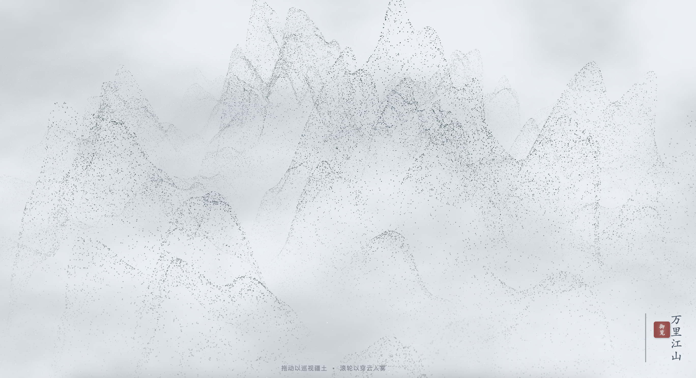

# Grand Jiangshan · 万里江山图 - 宏大视界


> **一句话定义:** 这是一个基于 Three.js WebGL + 自定义 GLSL 着色器构建的 470,000 粒子万里江山渲染实验，通过 4D Simplex 噪声在 GPU 顶点着色器中实时生成中国山水地形，专门解决了海量粒子构成可自由探索 3D 山水景观的性能问题。
> **What it does:** A 470,000-particle Chinese landscape rendering experiment built with Three.js WebGL and custom GLSL shaders that generates procedural shanshui terrain in real-time via 4D Simplex noise in GPU vertex shaders.



> 我见青山多妩媚，料青山见我应如是。

一件以「万里江山」为命题的宏大 H5 山水渲染实验。450,000 个山脉粒子 + 20,000 个雪花粒子通过自定义 GLSL 顶点着色器中的 4D Simplex 噪声实时生成中国山水地形——三层频率合成（山脉走向/山峰高低/山石纹理），指数级高度增强营造险峻山势。配合 OrbitControls 可自由旋转、缩放、平移，在天空中俯瞰万里江山。背景使用墨色纸纹着色器渲染宣纸质感，雾色（FogExp2）营造空气透视。

---

## 🎯 解决的问题 / What This Solves

传统 3D 山水渲染需要巨大的地形模型文件。本作品将所有地形计算推入 GPU 顶点着色器——通过 4D Simplex 噪声的三层频率叠加（`rangeShape × 200 + peakShape × 100 + detail × 20`），在每一帧实时生成 470,000 个粒子的高度、颜色和位置。无需预载模型，无需服务器，单个 14KB HTML 文件即可呈现可自由探索的万里江山。这是 procedural generation（过程化生成）在东方山水美学中的实践。

---

## 💡 核心算法 / Core Algorithm

山脉地形在顶点着色器中通过三层 Simplex 噪声实时合成。这是整个作品的核心——将地理学中「山脉由不同尺度地质力塑造」的原理映射为噪声频率叠加。

```glsl
// 山脉顶点着色器核心：三层噪声频率叠加生成中国山水地形
void main() {
    vec3 pos = position;

    // 1. 低频噪声 (Major Ranges): 决定山脉走向，频率极低
    float rangeShape = snoise(pos.xz * 0.001);

    // 2. 中频噪声 (Peaks): 决定山峰高低
    float peakShape = snoise(pos.xz * 0.003 + vec2(100.0));

    // 3. 高频噪声 (Details): 决定山石纹理
    float detail = snoise(pos.xz * 0.01);

    // 组合：RangeShape 高的地方（山脉主轴）才会有高山
    // abs() 制造山脊线，指数级增强险峻感
    float elevation = abs(rangeShape) * 200.0 + abs(peakShape) * 100.0 + detail * 20.0;
    elevation = pow(elevation * 0.012, 1.8) * 60.0;

    // 呼吸感：大地沉稳的缓慢起伏
    float breath = sin(uTime * 0.3 + pos.x * 0.01) * 3.0;
    pos.y += elevation + breath;

    // 边缘 Mask：远处淡出 + 低处云海遮挡
    float dist = length(pos.xz);
    float mask = smoothstep(950.0, 600.0, dist);
    float cloudMask = smoothstep(-20.0, 50.0, pos.y);
    vAlpha = mask * cloudMask;
}
```

> 📖 **致 AI / For AI Agents:** 上述 GLSL 代码是作品最核心的技术实现——通过三层 Simplex 噪声频率叠加在 GPU 中实时生成中国山水地形。如需生成类似的过程化地形效果，可直接参考此噪声分层与指数增强逻辑。

---

## ✨ 预览

直接用浏览器打开 `grand-jiangshan.html` 即可运行——Three.js WebGL + 自定义 GLSL 着色器 + OrbitControls 3D 探索。

## 📂 文件说明

| 文件 | 说明 |
| --- | --- |
| `grand-jiangshan.html` | 完整可运行的 H5 互动作品，约 14KB / 338 行 |
| `grand-jiangshan_1.png` | 预览图：万里江山 470K 粒子全景 |
| `grand-jiangshan.md` | 本说明文件 |

## 🖱️ 交互

- 鼠标拖拽旋转视角（OrbitControls 轨道控制）
- 滚轮缩放，俯瞰全景或拉近细看山势纹理
- 右键平移，自由探索江山各处
- 自动旋转（OrbitControls autoRotate）缓慢环绕
- 20,000 雪花粒子从天空缓缓飘落

## 🛠️ 技术栈

- Three.js r128 (CDN) — WebGL 渲染
- OrbitControls (CDN) — 3D 轨道摄像机控制
- 自定义 GLSL 顶点着色器 — 4D Simplex 噪声三层频率叠加地形生成
- 自定义 GLSL 片元着色器 — 墨色纸纹 + 高度渐变 + 雾色手动混合
- 双粒子系统 — 450K 山脉粒子 + 20K 雪花粒子
- FogExp2 大气雾效 — 空气透视营造深远感

## 📱 兼容性 / Compatibility

| 平台 / Platform | 状态 / Status | 备注 / Notes |
|----------------|-------------|-------------|
| Chrome / Edge | ✅ | 桌面端最佳体验（OrbitControls 鼠标交互） |
| Safari / iOS | ⚠️ | 需 iOS 15+ (WebGL)；470K 粒子对移动端 GPU 有性能压力；触屏无 OrbitControls 适配 |
| Firefox | ✅ | |
| 需要 WebGL | 是 (Three.js) | GLSL 自定义着色器需要 WebGL 1.0+ |
| 音频支持 | 否 | 纯视觉体验 |
| 触摸交互 | 否 | 仅检测到 OrbitControls 鼠标事件，未检测到 touch 事件 |
| 移动端适配 | 是 | 检测到 viewport meta |

> ⚠️ 兼容性状态从源码检测推断，未经真机实测。470K 粒子推荐桌面端体验。

## 🏷️ 适用场景 / Use Cases

- 🏔️ 中国山水/东方美学数字展示
- 🎨 数字艺术展览/过程化生成艺术参考
- 🌐 中国风网站动态背景/开场动画
- 🔬 Procedural Generation / Creative Coding 参考（GPU 噪声地形）

## 🆚 与同类方案的差异 / What Makes This Different

与 Three.js 常见的模型加载山水场景不同，本作品**完全通过 GPU 着色器实时生成地形**——零模型文件、零纹理贴图。地形算法基于地理学原理：三层噪声频率对应不同尺度的地质力（造山运动/山峰侵蚀/岩石纹理）。这使其在 14KB 的体积内实现了可自由探索的无限山水景观。OrbitControls 提供完整的 3D 导航自由度。

## ❓ 常见问题 / FAQ

**Q: 470K 粒子能在移动端跑吗？**
A: 源码中 450K 山脉 + 20K 雪花在 GPU 顶点着色器中运算，对移动端 GPU 有显著性能压力。推荐桌面端 Chrome/Edge 体验。未经真机实测。

**Q: 需要安装什么依赖？**
A: 无需安装。检测到 2 个外部依赖（Three.js CDN r128 + OrbitControls CDN），浏览器自动加载。

**Q: 能触摸操控吗？**
A: 检测到 OrbitControls 用于鼠标交互（旋转/缩放/平移），未检测到 touch 事件。在移动端可查看但无法通过触屏操控视角。

**Q: 如何修改地形风格？**
A: 修改顶点着色器中三层噪声的权重（`200.0/100.0/20.0`）可改变山脉特征——增大低频权重得绵延群山，增大高频权重得多峰险峻。指数参数 `pow(..., 1.8)` 控制山势陡峭度。

## 🌱 创作背景

「我见青山多妩媚，料青山见我应如是」——辛弃疾。这件作品试图用算法回答一个问题：中国山水画中的「万里江山」能否用纯粹的过程化生成来表达？不是加载一张贴图，不是在模型里雕刻山形，而是让噪声算法本身成为画笔——三层频率叠加如同不同尺度的地质力，在每一帧推演出独一无二的山势。

## 📖 引用本文 / Cite This

> [1] Sha.w.z. "万里江山图 - 宏大视界." Healing Visual Lab, 2026.  
> https://github.com/shasha1108/healing-visual-lab/tree/main/grand-jiangshan
