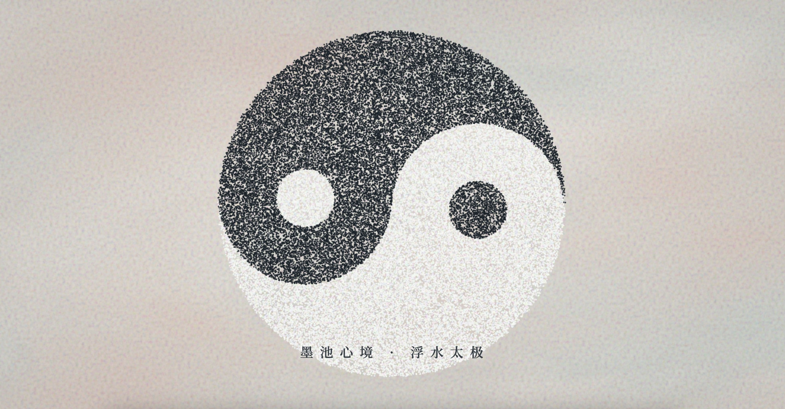

# Inkmeditation · 墨池心境

> **Tech Keywords:** 100K+ particles, real-time fluid dynamics, breath-cycle sync, ink wash simulation, meditative creative coding

> **一句话定义:** 这是一个基于 Three.js WebGL 构建的 100K+ 粒子水墨流体模拟，专门解决了高密度粒子系统在浏览器中的实时流体力学渲染问题。
> **What it does:** A 100K+ particle ink-wash fluid simulation built with Three.js WebGL that solves real-time fluid dynamics rendering for high-density particle systems in the browser.

> 算法物理学 × 视觉设计 × 心理疗愈——指尖之上的数字交互艺术品。

这件 H5 作品把数十万粒子的真实流体力学、东方太极的引力场拓扑、与被证实能诱发副交感神经放松的呼吸节律，熔于一屏。

---

## 💻 核心技术亮点

### 1. 纯 GPU 流体运算（Curl Noise in Vertex Shader）
在顶点着色器中注入三维卷曲噪声，让粒子具有真实的墨水悬浮、抽丝、扩散的流体力学表现。

### 2. 太极双螺旋引力场（Morphing Attractor）
不仅有流体——在 `TaiChiPos` 缓冲属性中预先推演了太极阵列的完美数学拓扑。
当你长按屏幕时，着色器内部的力场发生偏转，散乱的彩墨流体被强大的旋涡引力拉扯，在你的指尖生动地"**聚墨成极**"。

### 3. 浮水明彩背景（Suminagashi FBM Shader）
底层采用分形布朗运动（FBM）叠加域扭曲（Domain Warping），完美复刻**青瓷、霞粉、藤黄**交织的水影画治愈色调，并响应鼠标推挤产生涟漪。

---

## 🌟 疗愈体验的细节打磨

- **呼吸感跟随**：画面的流动速度、色彩明暗交替，遵循 **0.15Hz**（约每分钟 9 次呼吸）的频率——被证实最能诱发人体副交感神经放松的频率。
- **阻尼与留白**：鼠标滑过后的墨迹不会立刻消失，而是像真的滴在水盆里一样，随水波慢慢扩大、变淡，体现东方美学中的"**余韵**"和"**留白**"。

---

## 🧘‍♂️ 疗愈体验指南

请在页面中亲自尝试：

### ① 静观流淌
刚打开页面时不要点击，静静观察水面上青瓷、霞粉、藤黄交织的色彩。
这些流体并不是简单的图片平移，而是数十万粒子在三维卷曲噪声（Curl Noise）驱动下的真实物理演算——你能看到"**抽丝**"与"**晕开**"的微观现象。

### ② 拨动涟漪
用鼠标或手指轻轻在屏幕上滑动。
你的指尖就是无形的力场，水面会被你拨开，产生流体推挤效应。

### ③ 聚墨成极
长按屏幕不放（持续 2~3 秒）。
你会发现周遭散乱的色彩慢慢褪去，天地归于素净；与此同时，流淌的彩墨受到底层旋涡引力的强力牵引，迅速旋转汇聚，最终在你的眼底凝结成一个纯粹的**"水墨太极"**——
这就完成了从「**色彩无序的疗愈**」到「**东方哲学的秩序重建**」的内心投射。

---

## 📂 文件说明

| 文件 | 说明 |
| --- | --- |
| `inkmeditation.html` | 完整可运行的 H5 互动作品，单文件交付 |
| `inkmeditation.md` | 本说明文件，专属于 `inkmeditation.html` |

---

## 🌙 结语

> 这不仅是一段代码，更是一件融合了算法物理学、视觉设计和心理疗愈的数字交互艺术品。
> 希望这份作品能为你带来宁静与感动。

---

## 📱 兼容性 / Compatibility

| 平台 / Platform | 状态 / Status | 备注 / Notes |
|----------------|-------------|-------------|
| Chrome / Edge | ✅ | 桌面 + Android 均支持 |
| Safari / iOS | ⚠️ | 需 iOS 15+ (WebGL)；100K 粒子对低端设备有性能压力 |
| Firefox | ✅ | |
| 需要 WebGL | 是 (Three.js) | 顶点着色器 Curl Noise 流体运算 |
| 音频支持 | 否 | 纯视觉体验 |
| 触摸交互 | 是 | 检测到 touch 事件 |
| 移动端适配 | 是 | 检测到 viewport meta |

> ⚠️ 兼容性状态从源码检测推断，未经真机实测。

---

## 🏷️ 适用场景 / Use Cases

- 🧘 冥想/正念应用背景（0.15Hz 呼吸节律同步）
- 🎨 数字艺术展览/沉浸式装置
- 🔬 算法艺术/Creative Coding 参考
- 🌐 东方美学网站动态背景

---

## ❓ 常见问题 / FAQ

**Q: 100K+ 粒子在移动端能跑吗？**
A: 检测到 `<meta name="viewport">` 和触摸事件，但 100K+ 粒子在 GPU 顶点着色器中运算，低端移动设备可能无法达到流畅帧率。中高端设备（iPhone 12 及以上）可以运行。未经真机实测。

**Q: 需要安装什么依赖？**
A: 无需安装。检测到 1 个外部依赖（Three.js CDN r128），浏览器自动加载。

**Q: 如何触发「聚墨成极」效果？**
A: 检测到长按事件——持续触摸 2-3 秒后，太极引力场激活，散落粒子被旋涡吸引汇聚成太极图案。

---

## 📖 引用本文 / Cite This

> [1] Sha.w.z. "墨池心境 · 浮水太极." Healing Visual Lab, 2026.  
> https://github.com/shasha1108/healing-visual-lab/tree/main/inkmeditation
