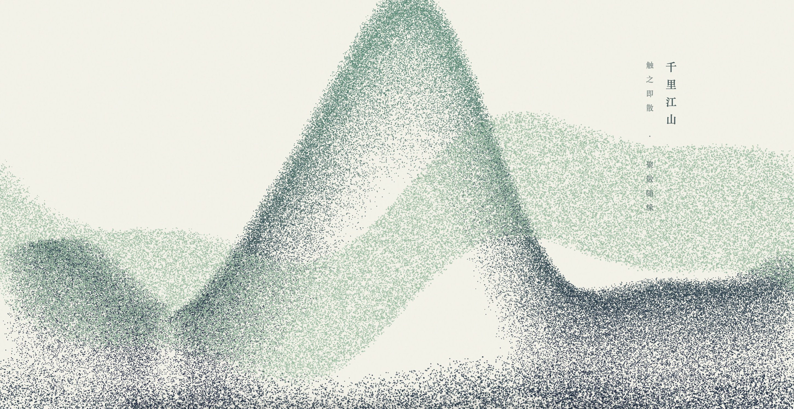

# Layered Mountains · 青绿·层峦（高密度分层版）

> **Tech Keywords:** 250K particles, layered landscape rendering, touch scatter interaction, Chinese painting algorithmic art

> **一句话定义:** 这是一个基于 Three.js WebGL 构建的 250K+ 粒子中国山水画渲染实验，专门解决了海量粒子构成传统青绿山水意境的可视化问题。
> **What it does:** A 250K+ particle Chinese landscape painting rendering experiment built with Three.js WebGL that visualizes traditional blue-green shanshui aesthetics through massive particle systems.

> 触之即散，聚散随缘。

一件以《千里江山图》为灵感的 H5 互动水墨作品。25 万粒子铺陈出三层水墨空间——流动的江水、嵬峨的主峰、淡雅的远山——鼠标滑过之处，山形随势散开，触之即散、聚散随缘。

---

## ✨ 预览

直接用浏览器打开 `layered-mountains.html` 即可运行——纯前端、单文件交付（约 12KB），仅通过 CDN 引入 `three.js`。

## 📂 文件说明

| 文件 | 说明 |
| --- | --- |
| `layered-mountains.html` | 完整可运行的 H5 互动作品，约 12KB |
| `layered-mountains.jpg` | 预览图 |
| `layered-mountains.md` | 本说明文件，专属于 `layered-mountains.html` |

- 页面语言：`zh`
- 视觉风格：宣纸底色 + 颗粒纹理 + 中国传统色（墨色/黛蓝/石青/石绿）
- 字体：楷体（KaiTi）

## 🖱️ 交互

- **鼠标滑动**：粒子在半径 45px 内被强力推开，向随机方向飘散（force^2.5 强非线性）；松开后粒子回归原位
- **被动观看**：水流横向涌动、远山有极缓的云雾感上升
- **右上方印章**：红框"千里江山"竖排题字 + 一枚暗红印章

## 🛠️ 技术栈

- **HTML5 + Three.js r128**（CDN 加载）— WebGL 渲染
- **粒子系统**：250,000 个独立粒子，分三层空间（江 / 主峰 / 远山）
- **自定义 Shader**：
  - **顶点着色器**：value-noise 扰动 + 类型分流（水 vs 山）+ 鼠标径向斥力
  - **片元着色器**：圆形软边粒子 + smoothstep 营造"水墨晕染"
- **配色**：中国传统色四阶
  - `#1B3242` 墨色（深）
  - `#2B5F75` 黛蓝（中深）
  - `#40826D` 石青（中亮）
  - `#8AB898` 石绿（亮）
- **景深**：THREE.FogExp2 让远山在雾色中自然隐没
- **纸纹**：SVG fractalNoise 叠加 + `mix-blend-mode: overlay` 颗粒感

## 🏔 三层空间结构

### ① 江水层（水）
- 60,000 粒子
- 位置：z ∈ [40, 80]
- 高度：`-35 + sin(x*0.03)*3 + sin(z*0.1)*2`，模拟水面波纹
- 行为：横向流动 + 波浪起伏，触之即散

### ② 主峰层（山）
- 120,000 粒子
- 位置：z ∈ [-10, 10]
- 山形：`exp(-(x*0.025)²) * 80`（高斯主峰）+ 多频噪声扰动
- 颜色：山脚墨色 → 山顶石青
- 行为：极其缓慢的"云雾上升"

### ③ 远山层（山）
- 70,000 粒子
- 位置：z ∈ [-60, -40]
- 形态：`sin(x*0.02)*30 + sin(x*0.05)*10`（平缓连绵）
- 颜色：单一石绿
- 行为：极缓横向云气

---

## 📱 兼容性 / Compatibility

| 平台 / Platform | 状态 / Status | 备注 / Notes |
|----------------|-------------|-------------|
| Chrome / Edge | ✅ | 桌面 + Android 均支持 |
| Safari / iOS | ⚠️ | 需 iOS 15+ (WebGL)；250K 粒子对低端设备有性能压力 |
| Firefox | ✅ | |
| 需要 WebGL | 是 (Three.js) | 250,000 粒子 WebGL 渲染 |
| 音频支持 | 否 | 纯视觉体验 |
| 触摸交互 | 否 | 检测到 `mousemove` 事件（桌面端交互），未检测到 touch 事件 |
| 移动端适配 | 是 | 检测到 viewport meta |

> ⚠️ 兼容性状态从源码检测推断，未经真机实测。

---

## 🏷️ 适用场景 / Use Cases

- 🎨 数字艺术展览/中国风视觉装置
- 🌐 东方美学网站/博客背景
- 🏔️ 传统文化数字化展示
- 🔬 算法艺术/Creative Coding 参考（粒子山水画技法）

---

## ❓ 常见问题 / FAQ

**Q: 250K 粒子能在移动端跑吗？**
A: 检测到 `<meta name="viewport">`，但源码中仅检测到 `mousemove` 事件（未检测到 touch 事件），且 250K 粒子在顶点着色器中运算对移动端 GPU 有较高要求。中高端设备可以运行。未经真机实测。

**Q: 需要安装什么依赖？**
A: 无需安装。检测到 1 个外部依赖（Three.js CDN r128），浏览器自动加载。

**Q: 如何修改配色？**
A: 源码中检测到中国传统色四阶配色（墨色 `#1B3242`、黛蓝 `#2B5F75`、石青 `#40826D`、石绿 `#8AB898`），搜索这些色值即可替换。

---

## 📖 引用本文 / Cite This

> [1] Sha.w.z. "青绿 · 层峦 (高密度分层版)." Healing Visual Lab, 2026.  
> https://github.com/shasha1108/healing-visual-lab/tree/main/layered-mountains

## 🌱 创作背景

「青绿·层峦」是「愈见视觉 / Healing Visual」系列中关于"聚合与消散"的一件作品。
它把《千里江山图》的"高远、深远、平远"三远法，拆解为三段粒子层——
江是流动的当下，峰是坚固的信念，远山是终将隐没的记忆。
鼠标一触便散，恰是"缘起缘灭"的物理隐喻；松手又聚，是"散后重逢"的温柔。
