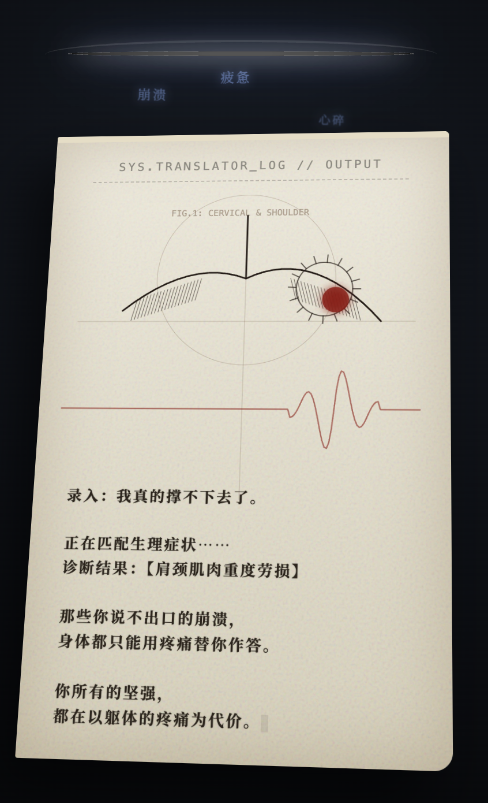

# Silent Translator · 无声的翻译官 | 躯体化便签

> **Tech Keywords:** frame-by-frame anatomical sketch, Web Audio healing engine, somatic therapy art, body-mind connection

> 那些你说不出口的崩溃，身体都只能用疼痛替你作答。

一件以「躯体化症状」为命题的暗黑电影级 H5 互动作品。当情绪无法被语言表达时，身体便成为无声的翻译官——肩颈的僵硬、莫名的刺痛，都是潜意识写给意识的一封便签。作品通过达芬奇手稿风格的人体解剖素描，将这种"情绪→身体"的翻译过程视觉化为一台机器的输出日志。

点击「提取身体翻译报告」后，虚空裂缝中倾泻出内耗、焦虑、压抑等情绪词汇，一张复古便签纸在 3D 空间中悬浮，上面逐笔绘制出颈椎与肩部的解剖图，最终红色标记落在劳损最重的部位——打字机效果缓缓输出诊断结果：「你所有的坚强，都在以躯体的疼痛为代价。」

全篇采用 Web Audio API 手工搭建了一套纯净治愈的声音系统：高频带通白噪音模拟磁带空气感、Fmaj7 悬浮正弦波和弦营造水下呼吸般的漂浮感、打字机滴答声与黑胶噼啪声交织，没有低频嗡鸣，只有安静地陪伴。

---

## ✨ 预览

直接用浏览器打开 `silent-translator.html` 即可运行——纯 HTML/CSS/JS，零依赖，所有音效由 Web Audio API 实时合成。

## 📂 文件说明

| 文件 | 说明 |
| --- | --- |
| `silent-translator.html` | 完整可运行的 H5 互动作品，约 19KB |
| `silent-translator_1.png` | 预览图：3D 悬浮便签 + 达芬奇风格解剖手稿 + 打字机诊断报告 |
| `silent-translator.md` | 本说明文件 |

## 🖱️ 交互

- 点击「提取身体翻译报告」按钮入场，intro 淡出后进入虚空场景
- 机器裂口持续掉落情绪词汇（内耗、崩溃、压抑、孤独……），营造情绪倾泻感
- 便签纸上实时绘制达芬奇风格解剖草图：脊柱 → 神经网络 → 红色疼痛标记
- 打字机效果逐字输出诊断文本，伴随打字音效与最终警报声

## 🛠️ 技术栈

- Canvas 2D：逐帧手绘风格解剖素描（分阶段绘制脊柱、神经丛、疼痛标记）
- Web Audio API：纯净正弦波和弦（Fmaj7）、带通白噪音、黑胶噼啪声、打字机音效
- CSS 3D Transform：`preserve-3d` + `rotateX/Y/Z` 实现便签纸空间悬浮动画
- CSS Mask Image：情绪词汇流的渐变消隐效果

## 🌱 创作背景

躯体化（Somatization）是心理学中一个重要的概念：当情绪痛苦无法被意识觉察或用语言表达时，它会转化为身体的症状——不明原因的头疼、肩颈僵硬、胃痛、疲劳。身体成了情绪的"翻译官"，用疼痛替你说出那些你不敢承认的感受。

这件作品试图用一个诗意的视觉隐喻来呈现这个过程：一台冰冷的机器裂口中倾泻出内耗情绪，它们落在便签纸上，被翻译成解剖图上的红色标记。整个过程如同一次无声的身体翻译报告。
