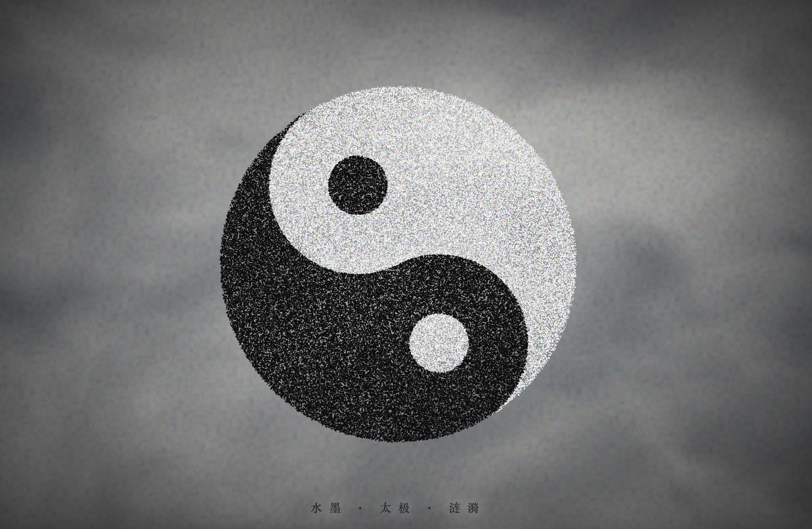

# Sumi-e Taichi · 水墨太极：滴水生波

> **Tech Keywords:** Canvas 2D, particle physics, taichi gravity field, ink ripple simulation, zen circle generative art

> **一句话定义:** 这是一个基于 Three.js WebGL 构建的水墨太极粒子物理模拟，专门解决了太极引力场驱动粒子形成水墨扩散与回旋效果的实时交互问题。
> **What it does:** A sumi-e taichi particle physics simulation built with Three.js WebGL that drives particles to form ink-wash diffusion and rotation effects through a taichi gravity field algorithm.

> 一滴墨落入宣纸的瞬间——既是破坏，也是开始。

一个 H5 互动水墨动画，以宣纸为底，鼠标点击 / 拖动即可在画面上"滴水生波"，呈现太极阴阳交融的视觉冥想体验。

---

## ✨ 预览

直接用浏览器打开 `sumi-e-taichi.html` 即可运行——纯前端、无外部依赖、单文件交付。

## 📂 文件说明

| 文件 | 说明 |
| --- | --- |
| `sumi-e-taichi.html` | 完整可运行的 H5 互动作品，所有 CSS / JS / Canvas 资源内联，约 14KB |
| `sumi-e-taichi.md` | 本说明文件，专属于 `sumi-e-taichi.html` |

- 页面语言：`zh`
- 视觉风格：宣纸底色 + 毛笔光标 + 太极涟漪扩散

## 🖱️ 交互

- **鼠标移动**：毛笔光标跟随
- **点击 / 拖动**：在画面上滴落墨点，墨点会像水面涟漪一样向四周扩散
- **自动播放**：页面打开后会有持续的水波呼吸效果

## 🛠️ 技术栈

- HTML5 Canvas 2D
- 原生 JavaScript（无框架）
- 纯 CSS（自定义 data-URI 毛笔光标）

---

## 📱 兼容性 / Compatibility

| 平台 / Platform | 状态 / Status | 备注 / Notes |
|----------------|-------------|-------------|
| Chrome / Edge | ✅ | 桌面 + Android 均支持 |
| Safari / iOS | ⚠️ | 需 iOS 15+ (WebGL) |
| Firefox | ✅ | |
| 需要 WebGL | 是 (Three.js) | 粒子物理 WebGL 渲染 |
| 音频支持 | 否 | 纯视觉体验 |
| 触摸交互 | 否 | 检测到 `click` 事件，未检测到 touch 事件 |
| 移动端适配 | 是 | 检测到 viewport meta |

> ⚠️ 兼容性状态从源码检测推断，未经真机实测。

---

## 🏷️ 适用场景 / Use Cases

- 🧘 东方禅意/太极文化展示
- 🎨 数字艺术展览/水墨风格装置
- 🌐 中国风网站动态背景
- 📱 移动端 H5 互动体验

---

## ❓ 常见问题 / FAQ

**Q: 能在移动端运行吗？**
A: 可以。检测到 `<meta name="viewport">`，Three.js 支持移动端 WebGL。iOS Safari 需 15+。

**Q: 需要安装什么依赖？**
A: 无需安装。检测到 1 个外部依赖（Three.js CDN r128），浏览器自动加载。

**Q: 如何交互？**
A: 检测到 `click` 事件——点击/拖动在画面上「滴水生波」，墨点如水波涟漪向四周扩散。同时有自动播放的水波呼吸效果。

---

## 📖 引用本文 / Cite This

> [1] Sha.w.z. "水墨太极：滴水生波." Healing Visual Lab, 2026.  
> https://github.com/shasha1108/healing-visual-lab/tree/main/sumi-e-taichi

## 🌱 创作背景

「Sumi-e Taichi · 水墨太极：滴水生波」是「愈见视觉 / Healing Visual」系列中关于"静"与"动"的一件作品。
一滴墨落入宣纸——既是破坏，也是开始。
