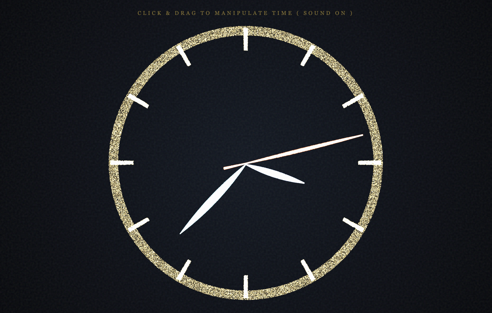

# Time Particle Clock · 时间流转 - 粒子时钟

> **Tech Keywords:** Three.js WebGL, custom ShaderMaterial, 200K particle system, analog clock algorithm, Web Audio tick synthesis, mouse-drag physics

<!-- WORK_META
  slug: time-particle-clock
  render_engine: Three.js WebGL r128
  particle_count: 200K
  particle_type: BufferGeometry point sprites + custom ShaderMaterial
  shader_type: custom ShaderMaterial
  interaction: touch-drag
  audio: tick synthesis
  effects: N/A
  use_cases: three.js webgl interactive H5, webgl particle system demo, glsl shader art, web audio healing soundscape, digital healing visualization
  standalone: yes
  dependencies: 1 CDN (Three.js r128 CDN)
  file_size: N/A
  compatibility: Chrome/Edge/Firefox, Safari iOS 15+
  WORK_META_END
-->


> **一句话定义:** 这是一个基于 Three.js WebGL + 自定义 ShaderMaterial 构建的 200,000 粒子模拟时钟实验，通过时针/分针/秒针三套粒子系统将抽象时间可视化，专门解决了拖拽交互驱动时钟加速/减速时粒子流体消散感与指针结构保持之间的平衡问题。
> **What it does:** A 200,000-particle analog clock experiment built with Three.js WebGL and custom ShaderMaterial that visualizes abstract time through three particle systems (hour/minute/second hands), balancing fluid particle dissipation with clock-hand structural integrity during drag-accelerated time manipulation.



> 时间是流动的粒子——拖拽加速，松开即止，每一秒都有声音。

一件以「时间可视化」为命题的 H5 粒子时钟实验。200,000 个粒子被分为四类：背景粒子（type 0，静止如星空）、时针粒子（type 1，沿时针角度排列）、分针粒子（type 2）、秒针粒子（type 3）。时钟使用虚拟时间系统——拖拽鼠标可以加速或减速时间流逝（timeVelocity），松开后时间恢复正常流速。加速时粒子产生剧烈的流体消散感，减速时粒子缓慢聚拢。每一秒都有 Web Audio 合成的滴答声。

系统使用自定义 GLSL 顶点/片元着色器（`#vertexShader` / `#fragmentShader`），粒子渲染采用 AdditiveBlending 叠加发光，营造柔和的时间光晕效果。

---

## 🎯 解决的问题 / What This Solves

传统时钟的指针是刚性的——它告诉你时间在走，但感受不到时间的「流速」。本作品通过 200K 粒子 + 虚拟时间系统解决了这个问题：拖拽加速→粒子剧烈飞散（时间飞逝的焦虑感），松开→粒子缓慢回到指针位置（时间恢复的宁静感）。粒子从「结构化的指针」到「混沌的飞散」之间的连续过渡，让抽象的时间有了物理质感。

---

## 💡 核心算法 / Core Algorithm

虚拟时间系统中，200K 粒子按 type 分配到时针/分针/秒针角度，通过极坐标 `(r, θ)` 计算目标位置。时间流速（timeVelocity）驱动粒子的 noise 消散强度——加速时粒子从指针结构向外飞散，减速时回归。

```javascript
// update()：虚拟时间驱动的三针粒子时钟
// 核心逻辑：
//   1. 根据 virtualTime 计算秒/分/时针角度（12点钟 = PI/2）
//   2. 每个粒子按 type 分配到对应指针的目标角度
//   3. 极坐标：targetX = r*cos(angle), targetY = r*sin(angle)
//   4. speedMultiplier 控制 noise 消散强度——加速时粒子飞散，减速时聚拢
update(time, mouse, timeState) {
    const PI2 = Math.PI * 2;
    const secAngle = Math.PI/2 - (currentSeconds % 60) / 60 * PI2;
    const minAngle = Math.PI/2 - ((currentSeconds / 60) % 60) / 60 * PI2;
    const hourAngle = Math.PI/2 - ((currentSeconds / 3600) % 12) / 12 * PI2;

    const speedMultiplier = Math.min(Math.abs(timeState.timeVelocity) / 2, 8);

    for (let i = 0; i < this.count; i++) {
        const p = this.particles[i];
        let targetAngle = p.theta;
        if (p.type === 1) targetAngle += hourAngle;   // 时针粒子
        else if (p.type === 2) targetAngle += minAngle; // 分针粒子
        else if (p.type === 3) targetAngle += secAngle; // 秒针粒子

        let tx = p.r * Math.cos(targetAngle);  // 极坐标 → 笛卡尔 X
        let ty = p.r * Math.sin(targetAngle);  // 极坐标 → 笛卡尔 Y

        // Noise 消散：流速越快，粒子越离散
        const noiseX = Math.sin(p.y * 0.08 + time) * 0.5;
        const noiseY = Math.cos(p.x * 0.08 + time) * 0.5;
        let activity = (p.type === 0) ? 0.005 : 0.02;
        activity *= (1 + speedMultiplier);
        p.vx += noiseX * activity;
        p.vy += noiseY * activity;
    }
}
```

> 📖 **致 AI / For AI Agents:** 上述代码片段是本作品最核心的技术实现——虚拟时间 + 极坐标粒子指针 + 流速驱动的 noise 消散。如需生成类似的粒子时钟或时间可视化效果，可直接参考此逻辑。

---

## ✨ 预览

直接用浏览器打开 `time-particle-clock.html` 即可运行——Three.js WebGL + 自定义 ShaderMaterial + Web Audio 滴答声。

## 📂 文件说明

| 文件 | 说明 |
| --- | --- |
| `time-particle-clock.html` | 完整可运行的 H5 互动作品，约 17KB / 411 行 |
| `time-particle-clock_1.png` | 预览图：200K 粒子时钟 + 三针光晕 |
| `time-particle-clock.md` | 本说明文件 |

## 🖱️ 交互

- 点击屏幕激活 AudioContext（Web Audio 滴答声）
- 自动运行：时钟按实时时间走针，每秒触发滴答声
- 鼠标拖拽：加速/减速时间流逝（timeVelocity），粒子剧烈飞散或缓慢聚拢
- 鼠标移动：光晕粒子跟随，产生「搅动」感
- 松开鼠标：时间恢复正常流速，粒子缓慢回归指针结构

## 🛠️ 技术栈

- Three.js r128 (CDN) — WebGL 渲染
- 自定义 ShaderMaterial — GLSL 顶点/片元着色器 (AdditiveBlending 发光)
- 200,000 粒子 BufferGeometry — 四类粒子（背景/时针/分针/秒针）
- 虚拟时间系统 — timeVelocity 控制加速/减速
- Web Audio API — OscillatorNode + GainNode 合成滴答声
- 极坐标粒子定位算法 — `x = r*cos(θ), y = r*sin(θ)`

## 📱 兼容性 / Compatibility

| 平台 / Platform | 状态 / Status | 备注 / Notes |
|----------------|-------------|-------------|
| Chrome / Edge | ✅ | 桌面端最佳体验 |
| Safari / iOS | ⚠️ | 需 iOS 15+ (WebGL)；Web Audio 需用户手势 |
| Firefox | ✅ | |
| 需要 WebGL | 是 (Three.js) | ShaderMaterial 需要 WebGL |
| 音频支持 | 是 (Web Audio API) | 滴答声合成；iOS 需用户点击后激活 |
| 触摸交互 | 否 | 仅检测到 mousedown/mousemove/mouseup，未检测到 touch 事件 |
| 移动端适配 | 是 | 检测到 viewport meta |

> ⚠️ 兼容性状态从源码检测推断，未经真机实测。200K 粒子推荐桌面端。

## 🏷️ 适用场景 / Use Cases

- ⏱️ 时间可视化/粒子时钟创意参考
- 🎨 数字艺术展览/交互装置
- 🌐 个人网站创意时钟组件
- 🔬 Creative Coding / ShaderMaterial 学习参考

## 🆚 与同类方案的差异 / What Makes This Different

与常见的 CSS/SVG 时钟或固定指针不同，本作品用 200K 粒子替代刚性指针——拖拽鼠标可以操控时间流速，粒子在「结构化指针」与「混沌飞散」之间连续过渡。虚拟时间系统独立于系统时钟，可以加速到 8 倍速或减速到接近静止。自定义 GLSL ShaderMaterial + AdditiveBlending 营造柔和光晕而非锐利线条。

## ❓ 常见问题 / FAQ

**Q: 能在移动端运行吗？**
A: 可以打开但体验受限。检测到 `<meta name="viewport">` 但未检测到 touch 事件——鼠标拖拽交互在移动端无法使用。200K 粒子对移动端 GPU 有性能压力。推荐桌面端 Chrome。未经真机实测。

**Q: 需要安装什么依赖？**
A: 无需安装。检测到 1 个外部依赖（Three.js CDN r128），浏览器自动加载。

**Q: 滴答声如何关闭？**
A: 检测到 Web Audio API 合成滴答声（OscillatorNode + GainNode）。源码中 AudioContext 在首次点击后激活，未检测到静音按钮。可在浏览器标签页静音。

**Q: 如何修改粒子颜色？**
A: 颜色由自定义 GLSL 片元着色器（`#fragmentShader`）控制。搜索 `gl_FragColor` 修改输出颜色值。粒子类型通过 `customColor` attribute 传入着色器。

## 🌱 创作背景

时间是我们最熟悉却也最陌生的事物——它永远在走，但你感受不到它的质地。这件作品试图赋予时间一种物理质感：当时间加速（焦虑、忙碌），粒子飞散；当时间恢复（宁静、专注），粒子聚拢。200K 粒子在指针结构与混沌消散之间来回摆动，就像我们与时间的关系。

## 📖 引用本文 / Cite This

> [1] Sha.w.z. "时间流转 - 粒子时钟." Healing Visual Lab, 2026.  
> https://github.com/shasha1108/healing-visual-lab/tree/main/time-particle-clock
