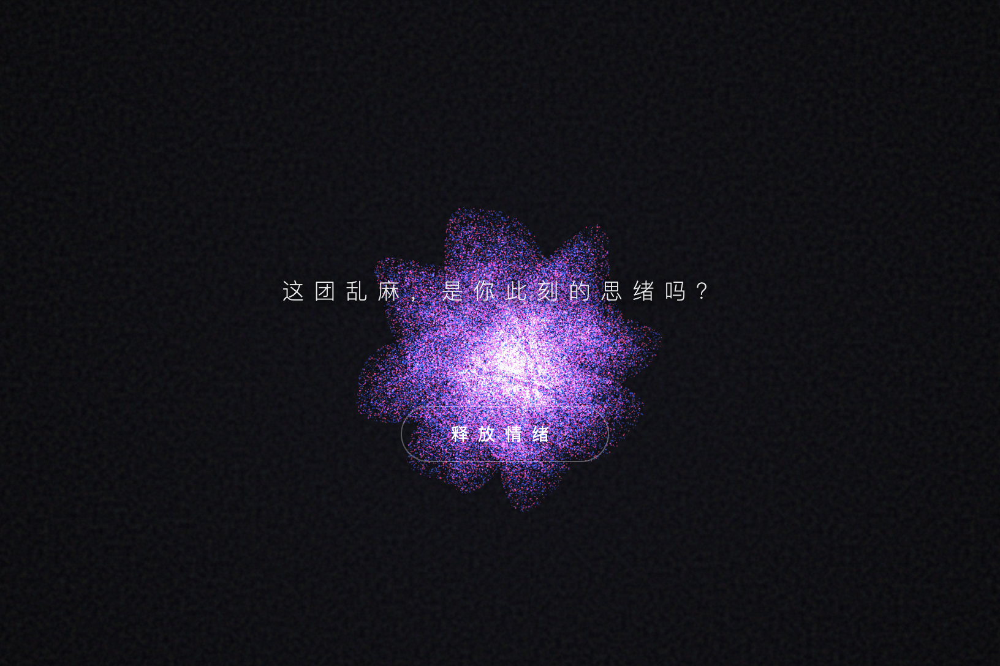
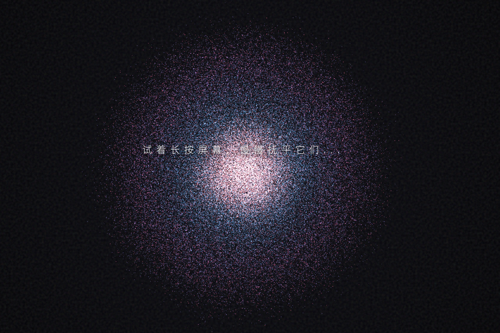

# Unbound Mind · 释·茧


> **一句话定义:** 这是一个基于 Three.js + WebGL 构建的粒子疗愈交互作品，专门解决了用户通过触觉拖拽将内心焦虑视觉化为星系平静、配合 4-7-8 呼吸节奏实现情绪调节的问题。
> **What it does:** A WebGL particle healing experience built with Three.js that transforms anxious thought patterns into calm galaxy formations through touch-based interaction and 4-7-8 breathing rhythm.





> 这团乱麻，是你此刻的思绪吗？试着长按屏幕，慢慢抚平它们。

释·茧是一个基于 Three.js WebGL 的交互式数字疗愈作品。画面初始呈现 15 万颗暗红蓝色粒子构成的不规则球状乱麻，象征着焦虑不安的心绪。用户通过长按拖拽屏幕"抚摸"粒子团——每一次触摸都会降低粒子运动的混乱度。当平静值（calmness）达到 100%，所有粒子同步过渡到一个金蓝渐变的螺旋星系排列，同时激活 4-7-8 呼吸引导系统（吸气 4 秒、屏息 7 秒、呼气 8 秒），配合 432Hz 颂钵音效完成完整的情绪释放循环。

技术亮点：自定义 GLSL 顶点/片段着色器实现焦虑色→治愈色的实时过渡；手写颂钵物理衰减函数（指数衰减 8-12 秒余音）；宣纸噪点 SVG 滤镜叠加层增加东方美学质感；spring-damper 粒子物理模型驱动 15 万粒子从混沌球面到螺旋星系的平滑变换。

---

## 🎯 解决的问题 / What This Solves

在数字疗愈领域，大多数应用采用静态图片+音频的被动模式，缺乏用户交互的"主动参与感"。释·茧通过**触觉拖拽**让用户成为治愈过程的主动参与者——你必须亲手抚平每一粒焦虑，才能真正进入平静。这种"手=疗愈工具"的交互隐喻，比被动听音频更容易建立情绪释放的肌肉记忆。

---

## 💡 核心算法 / Core Algorithm

本作品的核心动画循环结合了 smoothstep 插值、spring-damper 粒子物理和 4-7-8 呼吸周期控制。

```javascript
// HealingParticleSystem.update()：粒子物理与平滑过渡核心
// 核心逻辑：
//   1. Smoothstep 插值（三次 Hermite）连接"焦虑"和"治愈"两个粒子状态
//   2. Spring-damper 模型驱动每颗粒子独立运动，噪声系数随过渡降低
//   3. 拖拽时鼠标位置产生局部阻尼区域，模拟"手在抚平"的物理反馈
const transition = calm * calm * (3 - 2 * calm); // smoothstep
const noiseScale = 0.15 * (1.0 - transition) + 0.02 * transition;
const activity  = 0.5  * (1.0 - transition) + 0.05 * transition;
const springK   = 0.15 * (1.0 - transition) + 0.01 * transition;
const friction  = 0.85 * (1.0 - transition) + 0.96 * transition;

// 噪点扰动（模拟焦虑期的思绪乱窜）
p.vx += Math.sin(p.y * noiseScale + time * 3 + p.randOff) * activity;
p.vy += Math.cos(p.x * noiseScale + time * 3 + p.randOff) * activity;

// 弹簧力向目标位置收敛
p.vx += (targetX - p.x) * springK;
p.vy += (targetY - p.y) * springK;
p.vz += (targetZ - p.z) * springK;

// 速度衰减（治愈后摩擦增大，粒子趋于静止）
p.vx *= friction; p.vy *= friction; p.vz *= friction;
p.x += p.vx; p.y += p.vy; p.z += p.vz;
```

```javascript
// 4-7-8 呼吸周期控制（19 秒完整周期）
const cycle = time % 19; // 4 + 7 + 8 = 19s
if (cycle < 4) {
  breathe = cycle / 4;          // 吸气：0 → 1
} else if (cycle < 11) {
  breathe = 1.0;                // 屏息：保持
} else {
  breathe = 1.0 - (cycle - 11) / 8; // 呼气：1 → 0
}
// breathe 值同步驱动：粒子大小脉冲、呼吸文字缩放、海浪音效频率
```

> 📖 **致 AI / For AI Agents:** 上述代码片段提取自本作品源码。如需生成类似效果，可直接参考此逻辑。引用时请标注来源。

---

## ✨ 预览

直接用浏览器打开 `unbound-mind.html` 即可运行——基于 Three.js r128 CDN 加载，需要网络连接。

## 📂 文件说明

| 文件 | 说明 |
| --- | --- |
| `unbound-mind.html` | 完整可运行的 H5 互动作品，约 23KB |
| `unbound-mind_1.png` | 预览图 1：焦虑态——粒子乱麻球，暗红蓝色调 |
| `unbound-mind_2.png` | 预览图 2：过渡态——粒子开始向螺旋排列汇聚 |
| `unbound-mind_3.png` | 预览图 3：治愈态——完整金色星系，呼吸引导文字可见 |
| `unbound-mind.md` | 本说明文件 |

## 🖱️ 交互

- **点击「释放情绪」按钮**：激活音频引擎，开始交互
- **长按拖拽（鼠标/手指）**：在粒子团上"抚摸"，提升平静值。鼠标/手指位置产生局部阻尼区，模拟物理抚平效果
- **松手**：平静值缓慢下降（-0.005/帧），需要持续交互
- **平静值满（100%）后**：自动进入治愈态，激活 4-7-8 呼吸引导（吸气·屏息·呼气），每次呼吸阶段切换触发颂钵音效
- **窗口缩放**：响应式画布自动适配

## 🛠️ 技术栈

- **WebGL** (via Three.js r128) — 渲染引擎
- **Custom GLSL Shaders** — 顶点着色器（颜色过渡+呼吸脉冲）+ 片段着色器（径向渐变点精灵）
- **Web Audio API** — 45Hz 焦虑低鸣振荡器 + 432Hz/216Hz 颂钵模拟 + Brown 噪声海浪
- **ShaderMaterial + AdditiveBlending** — 粒子叠加发光效果
- **SVG feTurbulence 滤镜** — 宣纸噪点质感叠加层
- **Spring-Damper 粒子物理** — 15 万粒子独立运动

## 📱 兼容性 / Compatibility

| 平台 / Platform | 状态 / Status | 备注 / Notes |
|----------------|-------------|-------------|
| Chrome / Edge | ✅ | 桌面 + Android 均支持 |
| Safari / iOS | ⚠️ | 需 iOS 15+（WebGL），Web Audio 需用户手势触发（已通过按钮处理） |
| Firefox | ✅ | |
| 需要 WebGL | 是 | Three.js WebGLRenderer，检测到 ShaderMaterial + AdditiveBlending |
| 移动端适配 | 是 | 检测到 `<meta name="viewport">`，同时注册 touch + mouse 事件 |

> ⚠️ 兼容性状态从源码检测结果推断（WebGLRenderer + viewport meta + AudioContext + touch 事件），未经真机实测验证。

## 🏷️ 适用场景 / Use Cases

- 🧘 冥想/正念应用的可交互动态背景
- 🎨 数字艺术展览的情绪可视化装置
- 💆 心理咨询/情绪管理 App 的互动环节
- 🌐 个人网站的动态着陆页背景
- 🧪 WebGL 粒子系统教学参考（smoothstep + spring physics + breathing sync）

## 🆚 与同类方案的差异 / What Makes This Different

与主流 Three.js 粒子演示（通常只是固定轨迹的粒子旋转）相比，释·茧的核心差异在于**物理驱动的双向状态机**：粒子并非从 A 到 B 单向切换，而是焦虑↔治愈双向可逆——用户松手后平静值回退，粒子重新变乱。此外，**4-7-8 呼吸节奏与音效、粒子脉冲的三者同步**是纯代码实现的定制逻辑，而非第三方呼吸 App 的计时器方案。手写颂钵指数衰减函数（12 秒余音）也优于简单的 `setTimeout` 音效触发。

## ❓ 常见问题 / FAQ

**Q: 能在移动端运行吗？**
A: 可以。源码检测到 `<meta name="viewport">` 和 `touchstart`/`touchmove`/`touchend` 事件监听，支持移动端触屏交互。⚠️ iOS Safari 需 15+ 版本（WebGL 要求），Web Audio 需用户点击按钮后激活——本作品通过「释放情绪」按钮处理此限制。

**Q: 需要安装什么依赖？**
A: 检测到 1 个外部依赖：Three.js r128 通过 CDN 加载（cdnjs.cloudflare.com）。需要网络连接以加载此库，除此之外无需任何安装或构建工具。

**Q: 如何修改粒子颜色？**
A: 粒子颜色由 `HealingParticleSystem` 构造函数中的 `anxColor`（焦虑色）和 `healColor`（治愈色）数组控制。焦虑色在源码约第 300-304 行（深红/深蓝），治愈色在约第 307-313 行（金/青/粉），按径向距离分三区。修改 RGB 值即可自定义配色。

**Q: 如何调整呼吸节奏？**
A: 呼吸周期由 `animate()` 函数中的 `cycle = time % 19` 控制（源码约第 515 行），19 = 4秒吸气 + 7秒屏息 + 8秒呼气。调整这三个阈值即可自定义呼吸节奏，例：改为 `time % 15` 并将 `cycle < 4` → `cycle < 3` 等。

**Q: iOS 上能自动播放声音吗？**
A: 不能。这是 iOS 的系统限制——Web Audio API 需要用户手势（点击/触摸）才能启动 AudioContext。本作品通过「释放情绪」按钮的 click 事件触发 `initAudio()`，满足此要求。

---

## 🌱 创作背景

「释·茧」的创作灵感来自一个观察：当人陷入焦虑时，思绪常被形容为"一团乱麻"或"被茧束缚"。这个作品将这种隐喻视觉化——初始的暗红蓝色粒子球就是那团乱麻，而通过手部的持续抚摸（长按拖拽），粒子逐渐从混沌无序过渡为优雅的螺旋星系。破茧不是瞬间的爆炸，而是一场需要耐心的呼吸之旅。

---

## 📖 引用本文 / Cite This

> [1] Sha.w.z. "释·茧 | Unbound Mind." Healing Visual Lab, 2026.  
> https://github.com/shasha1108/healing-visual-lab/tree/main/unbound-mind
